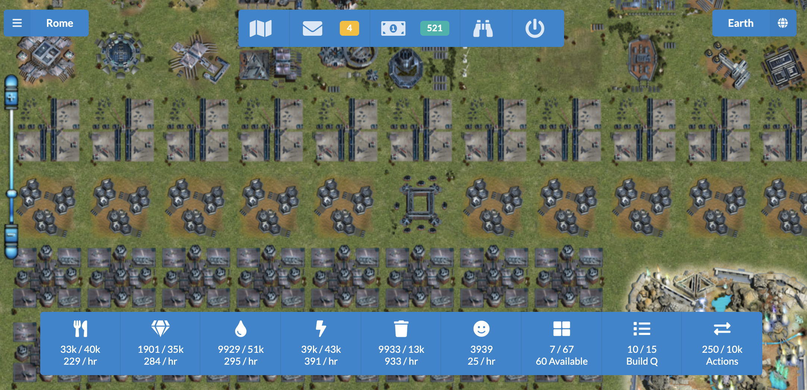

# Lacuna Expanse Frontend

Web client for the up-and-coming community edition of The Lacuna Expanse.

[](https://demo.tlecommunity.com/)

# Setup

Requires Node and npm:

```bash
git clone https://github.com/Kantigen/ka-web
cd ka-web
git submodule update --init --recursive
npm install
```

# Running

The client has two run modes for local development:

**`npm run dev`**: assumes you have [ka-server](https://github.com/Kantigen/ka-server) set up and running.

**`npm run dev:stubbed`**: uses a stubbed game server instead

# Ideas

Got an idea? [Let us know!](https://github.com/tlecommunity/v2/issues)

[](https://github.com/tlecommunity/v2/issues)

# Hacking

If you're interested in hacking on the client, hit up the [developer's documentation](docs/README.md).

# License

See the [LICENSE](LICENSE) file.
